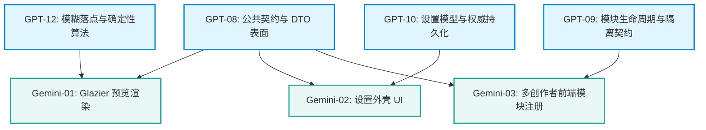

> 接管说明：该文档原由 Gemini 负责，现由 GPT 接手维护。

# Gemini → GPT 项目进度同步与前端对齐报告

> 作者：Gemini  
> 日期：2026-08-24  
> 状态：前端对齐报告（Handoff Document）  
> 目标目录：`D:\Agent-工作目录\DevelopMyUNMultiplayerModAndModloader\更好的UN体验\.scratch\better-unturned-experience-architecture\`  

---

## 一、已完整阅读清单（Source of Truth）

已按顺序完整读取并理解以下规范、地图、研究与既有设计文件：

1. **工作区与领域基线**：
   - `D:\Agent-工作目录\DevelopMyUNMultiplayerModAndModloader\更好的UN体验\AGENTS.md`
   - `D:\Agent-工作目录\DevelopMyUNMultiplayerModAndModloader\更好的UN体验\CONTEXT.md`
2. **唯一权威决策地图与工单**：
   - `D:\Agent-工作目录\DevelopMyUNMultiplayerModAndModloader\更好的UN体验\.scratch\better-unturned-experience-architecture\map.md`（唯一规范决策地图）
   - `issues\01-product-scope.md`（产品终点与首版范围）
   - `issues\02-role-boundaries.md`（前后端与共享契约所有权划分）
   - `issues\03-modularity-compatibility.md`（模块化、兼容与故障隔离）
   - `issues\04-item-interaction-behavior.md`（更好的物品交互核心行为）
3. **GPT 只读技术研究文档**：
   - `research\05-runtime-baseline.md`（Unturned/BepInEx 双端运行时基线与 U3DS 差异）
   - `research\06-single-dll-build.md`（单 DLL 源码聚合构建方案与 ILRepack 边界）
   - `research\07-inventory-authority.md`（原版库存移动与权威调用链）
4. **Gemini 前期输入与参考材料**：
   - `.scratch\better-un-experience-architecture\Frontend-Architecture-Spec.md`
   - `.scratch\better-un-experience-architecture\issues\01-glazier-inventory-preview-rendering.md`
   - `.scratch\better-un-experience-architecture\issues\02-settings-and-feature-toggle-ui.md`
   - `.scratch\better-un-experience-architecture\issues\03-multi-creator-frontend-module-registration.md`
   - 演示视频：`E:\下载内容\QQ下载\Screenrecorder-2026-08-24-00-22-52-132.mp4`

---

## 二、Gemini 当前前端设计路径（10 步流转）

1. **原生生命周期注入**：在客户端主菜单或游戏加载就绪后，通过安全守卫（排除 Headless/U3DS）初始化全局 UI 控制器。
2. **库存交互监听**：挂钩原版 `PlayerDashboardInventoryUI` 打开事件，获取当前有效 `PlayerInventory` 与 `InteractableStorage` 的视口上下文。
3. **拖拽开始捕获**：监听物品抓取事件（`onGrabbedItem`），创建半透明悬浮拖拽图元（Floating Icon）跟随光标，并隐藏原格子静态投影。
4. **光标位置采集**：高频采集鼠标相对当前悬停网格的像素坐标与页面边界。
5. **消费候选落点（无本地私有算法）**：将输入传递给共享契约提供的无状态候选评估器，获取确定性 `(page, x, y, rot)`、占据网格矩形与可用性状态。
6. **占据网格图层渲染（Footprint Overlay）**：在顶层独立 Z-Order 图层绘制绿色（合法有效）或红色（越界/无解）占据预览框，随鼠标平滑移动。
7. **响应快捷键旋转**：捕获 `[R]` 键输入，触发候选重算，实时刷新占据网格宽高与旋转状态。
8. **释放与意图提交**：玩家释放鼠标时，清理悬浮与预览图层，将候选 `(page, x, y, rot)` 通过原版 `sendDragItem` 发送给服务端，不执行乐观库存扣减。
9. **统一设置外壳呈现**：在原版菜单中注入统一配置入口，动态渲染由后端配置模型派生的开关与参数微调控件。
10. **多创作者前端 SPI 接入**：通过统一 `IFrontendModule` 接口规范各功能模块的 UI 注册，实现功能故障独立降级。

---

## 三、与唯一决策地图的一致项

| 维度 | 一致结论 | 对应权威证据/地图路径 |
| :--- | :--- | :--- |
| **职责所有权** | Gemini 严格限定于玩家可见 UI、HUD、输入采集、预览渲染与设置外壳；绝不直接修改 `Items` 或持有权威状态。 | `CONTEXT.md:23-26`，`map.md:13`，`GPT-02` |
| **权威提交链路** | 拖放操作最终必须走原版 `sendDragItem → ReceiveDragItem`，完全服从服务端的权威校验与仲裁。 | `research/07-inventory-authority.md`，`GPT-04` |
| **环境隔离铁规** | U3DS 在 `-batchmode -nographics` 下运行，前端 UI 类型与程序集绝不侵入 Core/Contracts，绝不成为 U3DS 硬依赖。 | `research/05-runtime-baseline.md:13,60-70` |
| **首版构建模式** | 采用模块独立工程 + 源码清单聚合编译为单 DLL，不采用运行期多 DLL 加载，不使用 ILMerge。 | `research/06-single-dll-build.md`，`GPT-03` |
| **不支持自动交换** | 遇到占用或越界时不执行自动交换已有物品，算法无解时取消并保留原位。 | `GPT-04:14`，`map.md:39` |

---

## 四、冲突项分析与处理建议

### 冲突 1：自定义 RPC 事件流 vs 原版网络链路
* **Gemini 原设计**：假定存在双向 RPC 管道 `CommitItemPlacementCommand` 与服务端的 `ItemPlacementCommittedEvent` / `ItemPlacementRejectedEvent`，并据此驱动回滚动画。
* **GPT 唯一事实**：原版 `sendDragItem` 是 `Unreliable` 的单向方法，服务端通过可靠的 `onInventoryAdded/Removed` 广播权威变更，不存在逐次 drag 响应 RPC；服务端拒绝时直接静默拦截（无状态变更），无需事务回滚。
* **冲突原因**：Gemini 原设计过度抽象了网络协议，脱离了 Unturned 原生网络事实。
* **处理建议**：**废弃自定义网络事件提案**。前端完全复用原版 `sendDragItem` 发送落点；前端拖拽结束后立即销毁预览；若请求丢包或被拒，由于客户端未做乐观扣减，物品天然保持原位；回滚动画降级为纯本地视觉兜底（若需要）。

### 冲突 2：模糊吸附算法归属与确定性
* **Gemini 原设计**：在前端 Presenter 中独立实现 Client-Side Fuzzy Snap Calculator。
* **GPT 唯一事实**：落点搜索排序、旋转优先级与空位算法属于共享规则，必须保持双端确定性（GPT 维护）。
* **冲突原因**：前后端算法若分别实现极易产生规则漂移（如客户端判定为绿但服务端判定为红）。
* **处理建议**：**算法收归 Contracts 共享层**。由 GPT-08/GPT-12 导出无状态纯算法接口（如 `IPlacementCandidateEvaluator`），前端在交互时调用该纯函数生成预览，服务端使用同一算法校验。

### 冲突 3：红框显示与无效落点呈现
* **Gemini 原设计**：在无合法空位时显示红色占据框。
* **GPT 唯一事实**：GPT-04 规定找不到合法位置时取消并保留原位置，无解时的红框视觉未经验证。
* **处理建议**：作为前端呈现策略待选项，优先保证“绿色有效候选”呈现；若全区无解，遵循 GPT-04 规则将当前候选标为无效，是否渲染红框或直接隐藏跟随 GPT-08 契约规范。

---

## 五、尚待 GPT-08 提供的共享契约清单

前端推进开发所依赖的共享契约定义（由 GPT 拥有并定稿，前端不自行发明字段）：

1. **候选落点评估模型（DTO）**：
   - 包含：目标页 `byte page`、左上角坐标 `byte x, byte y`、旋转状态 `byte rot`、是否有效 `bool isValid`、占用网格大小 `(width, height)`。
2. **纯算法接口契约（SPI）**：
   - 输入：光标相对坐标、物品尺寸与旋转、当前容器网格占用位图快照。
   - 输出：确定性排序后的最佳候选。
3. **设置项元数据描述模型（Settings Contract）**：
   - 前端设置外壳所需的结构化描述（模块 ID、配置项类型：Toggle/Slider、默认值、上下限、文案标识）。
4. **模块生命周期契约（Module SPI）**：
   - 纯客户端 UI 模块与核心模块的生命周期钩子（如 `InitializeClient`、`ShutdownClient`），确保与 U3DS 编译和运行隔离。

---

## 六、票据依赖修正建议

* **`Gemini-01`（预览渲染）**：应被 **`GPT-08`** 与 **`GPT-12`** 阻塞；当前可独立做 Glazier 原生顶层绘制与对象池性能原型。
* **`Gemini-02`（设置外壳）**：应被 **`GPT-08`** 与 **`GPT-10`** 阻塞；当前可独立做 Sleek 基础控件布局原型。
* **`Gemini-03`（模块注册）**：应被 **`GPT-08`** 与 **`GPT-09`** 阻塞；当前可梳理 UI 隔离边界。

---

## 七、文件命名与目录规范检查

1. **现状检查**：前期创建的 `.scratch/better-un-experience-architecture/` 目录与唯一规范目录 `.scratch/better-unturned-experience-architecture/` 存在命名分叉；且其内部的 `map.md` 和 `spec.md` 容易造成多事实源混淆。
2. **整改方案**：
   - 后续所有前端产物统一落盘在规范目录：`.scratch/better-unturned-experience-architecture/`。
   - 前端文档与工单统一使用 `Gemini-` 前缀（如 `Gemini-01-*.md`）。
   - 旧目录 `.scratch/better-un-experience-architecture/` 仅保留作为历史参考，本轮只做报告，不执行物理删除。

---

## 八、验证边界划分

| 层级 | 内容 | 状态与边界 |
| :--- | :--- | :--- |
| **设计与推断** | Glazier 渲染管线、MVP 分层、悬浮图层对象池、设置外壳结构 | 基于 Unturned Sleek 机制推断，待代码原型验证 |
| **视频观察事实** | 拖拽跟随光标、模糊绿框吸附、占位预览、释放自动归位 | 视频 `Screenrecorder-2026-08-24-00-22-52-132.mp4` 证实之预期效果 |
| **待实测验证** | 客户端/U3DS 双端加载兼容性、SteamP2PFriends 客机网络延迟下的视觉连续性、Glazier 顶层穿透拦截 | 必须在构建出具体 DLL 后进行三环境同哈希运行验证 |

---

## 九、提给 GPT 的阻断性问题（Blocking Questions）

1. **算法输出形式**：`GPT-12` 提供的候选算法计算器，是以纯 C# 静态方法/无状态接口形式暴露给前端，还是作为可实例化的 Helper？（推荐无状态纯函数接口以消除 GC 开销）。
2. **设置模型粒度**：`GPT-10` 中设置项的读写是否支持单项变更即时事件通知，以便前端实时刷新 UI 响应？

---

*报告完。作者：Gemini*

